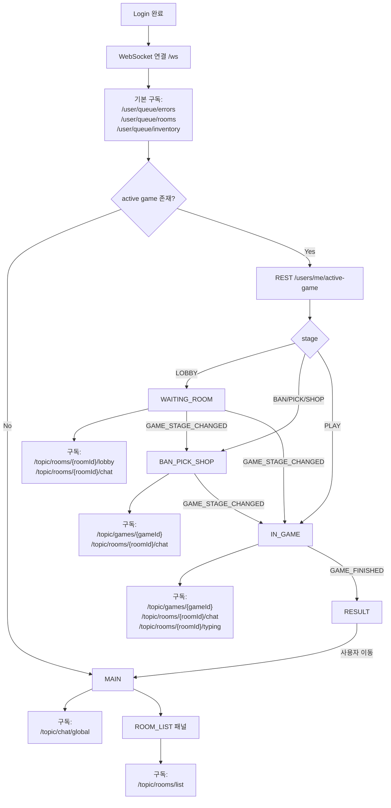
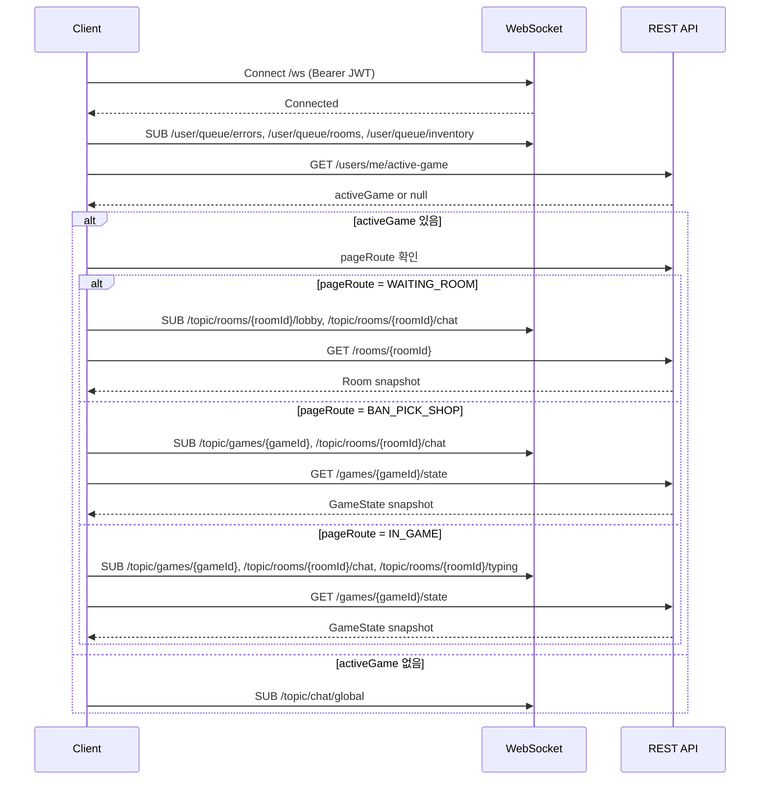

# CONTRACT_LIFECYCLE

## 0. 문서 목적
- REST/실시간 통신의 연결/구독/해제/호출 타이밍을 페이지 단위로 정의한다.
- REST는 스냅샷/명령, WebSocket은 상태 변화 이벤트를 담당한다.

## 관련 문서
- [[01_PRODUCT/USER_FLOWS.md]]
- [[03_API/CONTRACT/REST/OPENAPI.yaml.md]]
- [[03_API/CONTRACT/REALTIME/CONVENTIONS.md]]
- [[03_API/CONTRACT/REALTIME/TOPICS.md]]

---
## 1. 전제
- WebSocket endpoint: `/ws`
- 인증: `Authorization: Bearer <JWT>`
- 공통 Envelope/type 규칙은 REALTIME_CONVENTIONS를 따른다.
- active game은 FINISHED 시점에 즉시 해제된다.
  - RESULT 화면은 이벤트 기반으로 표시하되, 재접속 시 강제 복귀되지 않는다.

---
## 2. 연결 및 기본 구독
### 2.1 연결 시퀀스
1. 로그인 완료 후 WebSocket 연결
2. 기본 구독
   - `/user/queue/errors`
   - `/user/queue/rooms`
   - `/user/queue/inventory`
3. REST `/users/me/active-game`으로 복귀 여부 판단
4. active game이 없으면 MAIN으로 이동

### 2.2 재접속 규칙
- 연결 끊김/새로고침 시:
  1) WebSocket 재연결
  2) `/users/me/active-game` 재조회
  3) 해당 페이지 구독 재설정
  4) REST로 스냅샷 재조회(`/rooms/{roomId}`, `/games/{gameId}/state`)
- active game은 진행 중 게임만 포함한다.
  - FINISHED는 포함되지 않으며 결과 페이지로 복귀하지 않는다.

---
## 3. 페이지별 실시간 흐름 (구독 포인트)
### 3.0 원칙
- 아래 구독은 **페이지 진입 시 1회 설정**하며 stage 변화로 재구독하지 않는다.
- 동일 game/room 스코프는 페이지 전환 시에도 유지할 수 있다.
  - WAITING_ROOM → BAN_PICK_SHOP → IN_GAME 전환 시 room chat 구독은 유지된다.

### 3.1 MAIN
- 구독: `/topic/chat/global`
- 명령: `CHAT_SEND` (GLOBAL)
- ROOM_LIST 패널 활성 시 추가 구독: `/topic/rooms/list`
  - `ROOM_LIST_UPSERT`, `ROOM_LIST_REMOVED` 이벤트로 목록 델타 반영
  - 현재 화면에 보이는 room row 상태는 즉시 반영
  - 페이지 범위 밖 변화는 업데이트 인디케이터로 누적

### 3.2 WAITING_ROOM
- 구독:
  - `/topic/rooms/{roomId}/lobby`
  - `/topic/rooms/{roomId}/chat`
- 주요 이벤트:
  - ROOM_PLAYER_JOINED / ROOM_PLAYER_LEFT / ROOM_PLAYER_STATE_CHANGED
  - ROOM_HOST_CHANGED
- 명령:
  - `CHAT_SEND` (INGAME, roomId 포함)
- 게임 시작은 REST `/rooms/{roomId}/start`
  - 성공 응답의 `ActiveGame.pageRoute` 기준으로 다음 화면으로 전환

### 3.3 BAN_PICK_SHOP (RANKED)
- 구독:
  - `/topic/games/{gameId}`
  - `/topic/rooms/{roomId}/chat`
- 단계 진행:
  - REST `/games/{gameId}/ban`, `/pick`, `/shop/*`
  - 단계 전환은 `GAME_STAGE_CHANGED`로 동기화
- BAN/PICK/SHOP 단계 제한시간은 각 10초로 고정한다.
- 밴/픽/구매 결과는 `/topic/games/{gameId}` 이벤트로 전파한다.

### 3.4 IN_GAME
- 구독:
  - `/topic/games/{gameId}`
  - `/topic/rooms/{roomId}/chat`
  - `/topic/rooms/{roomId}/typing`
- 명령:
  - `CHAT_SEND` (INGAME)
  - `TYPING_UPDATE`
  - `ITEM_USE`, `SPELL_USE`
- 아이템/스펠 사용 성공 시:
  - ITEM_EFFECT_APPLIED / SPELL_EFFECT_APPLIED / EFFECT_REMOVED
  - INVENTORY_SYNC (본인)

### 3.5 RESULT
- 이벤트:
  - `GAME_FINISHED` 수신 시 결과 화면 표시
- 구독:
  - RESULT에서는 추가 구독을 설정하지 않는다.
  - 기존 `/topic/games/{gameId}` 구독은 결과 표시 직후 해제한다.
- 이후 이동:
  - MAIN 또는 MY_PAGE로 이동
  - active game은 이미 해제되어 재접속 복귀 대상이 아님

---
## 4. 단계 전이 기준
- NORMAL: LOBBY → PLAY → FINISHED
- RANKED: LOBBY → BAN → PICK → SHOP → PLAY → FINISHED
- 전이는 `GAME_STAGE_CHANGED` 이벤트로 통지된다.

---
## 5. 연결/구독/해제/REST 호출 타이밍 매핑
### 5.1 WebSocket 연결/해제
| 시점 | 액션 | 비고 |
|---|---|---|
| 로그인 성공 직후 | WebSocket 연결(`/ws`) | 실패 시 재시도 백오프 |
| 로그아웃 | WebSocket 연결 해제 | 모든 구독 해제 포함 |
| 브라우저 종료/탭 종료 | 연결 해제 | 서버는 heartbeat로 감지 |
| 새로고침/재접속 | 재연결 | 기본 구독 재설정 |

### 5.2 구독/해제 매핑
| 스코프 | 구독 시점 | 해제 시점 | 관련 REST 스냅샷 |
|---|---|---|---|
| User Queue(`/user/queue/*`) | 로그인 직후 연결 시 | 로그아웃/연결 종료 | `/users/me/active-game` |
| Global Chat(`/topic/chat/global`) | MAIN 진입 | MAIN 이탈 | 없음 |
| Room List(`/topic/rooms/list`) | ROOM_LIST 패널 진입 | ROOM_LIST 패널 이탈 | `/rooms` |
| Room Chat(`/topic/rooms/{roomId}/chat`) | 방 참가 후 WAITING_ROOM 진입 | 게임 종료 후 MAIN/MY_PAGE 이동 또는 방 이탈 | `/rooms/{roomId}` |
| Lobby(`/topic/rooms/{roomId}/lobby`) | WAITING_ROOM 진입 | WAITING_ROOM 이탈 | `/rooms/{roomId}` |
| Typing(`/topic/rooms/{roomId}/typing`) | IN_GAME 진입 | IN_GAME 이탈 또는 게임 종료 | `/games/{gameId}/state` |
| Game(`/topic/games/{gameId}`) | BAN_PICK_SHOP 또는 IN_GAME 진입 | GAME_FINISHED 수신 후 결과 표시 또는 방 이탈 | `/games/{gameId}/state` |

### 5.3 REST 호출 타이밍(스냅샷/명령)
| 시점                       | REST 호출                            | 목적                     |
| ------------------------ | ---------------------------------- | ---------------------- |
| 로그인 직후                   | `GET /users/me/active-game`        | 복귀 여부 판단               |
| ROOM_LIST 패널 진입            | `GET /rooms`                       | 목록 스냅샷 + listVersion 동기화 |
| ROOM_LIST 업데이트 적용         | `GET /rooms`                       | 누적 변경분 최신화             |
| ROOM_LIST 체류 중(20~30초)    | `GET /rooms`                       | 보정 재동기화                |
| 방 진입                     | `GET /rooms/{roomId}`              | 대기실 스냅샷                |
| 게임 진입/재접속                | `GET /games/{gameId}/state`        | 현재 stage/remaining 동기화 |
| READY/UNREADY/START/KICK | 해당 Room 명령 API                     | 대기실 명령                 |
| BAN/PICK/SHOP 구매         | 해당 Game 명령 API                     | 밴/픽/구매 처리              |
| 코드 제출                    | `POST /games/{gameId}/submissions` | 제출 처리                  |

---
## 6. 라이프사이클 다이어그램

