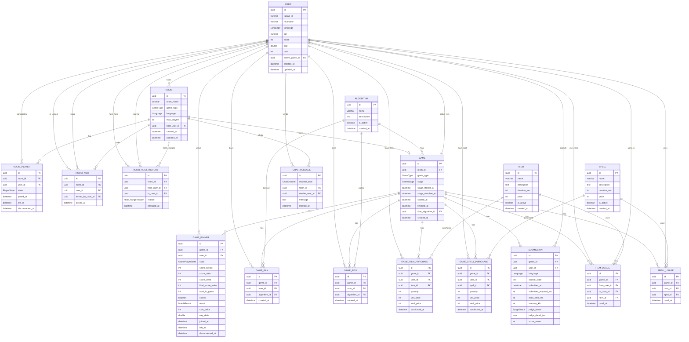

# DATA_MODEL

## 0. 작업 양식
데이터 모델 변경 시 아래 양식을 유지한다.

```
[변경 목적]
- 무엇을 왜 바꾸는가

[변경 내용]
- 엔티티/필드/관계/제약 변경 요약

[연관 문서 업데이트]
- 03_API/CONTRACT/REST/OPENAPI.yaml.md
- 03_API/CONTRACT/REST/ERROR_MODEL.md
```

---
## 1. 문서 목적
- LoL 프로젝트의 데이터베이스 설계를 단일 문서로 정의한다.
- AI 에이전트가 이 문서만 읽고 스키마를 구현할 수 있어야 한다.

## 관련 문서
- [[01_PRODUCT/GAME_RULES.md]]
- [[01_PRODUCT/ECONOMY.md]]
- [[01_PRODUCT/CATALOG.md]]

---
## 2. 엔티티 분류 규칙
엔티티는 아래 3가지 타입으로 구분한다.

- storage: **persistent**
  - DB 영구 저장 대상. 복구/감사/정산/통계에 필요.
- storage: **ephemeral**
  - 인메모리/캐시/세션 상태. 종료 후 보관 불필요.
- storage: **derived**
  - DB 저장 없이 계산 가능한 값.

기준:
- 재접속 복구, 부정행위 대응, 정산/통계에 필요 → persistent
- 실시간 UI용, 계산 가능, 종료 후 불필요 → ephemeral/derived

### 2.1 storage 의미(저장소)
- persistent: DB 영속 저장 대상.
- ephemeral/derived: Redis 실시간 상태 저장 대상(DB 테이블 없음).

### 2.2 Redis 실시간 상태 범위
- 실시간 상태(=ephemeral/derived)는 Redis가 단일 진실이다.
- DB에는 결과/이력/정산에 필요한 persistent만 기록한다.

### 2.3 Write Policy
- write-through: 상태 변경 즉시 DB에 기록한다. Redis는 캐시/미러로만 사용한다.
- write-back: Redis가 실시간 단일 진실이다. 종료 시점에 DB로 스냅샷을 반영한다.
- 기본값: persistent = write-through. 예외는 아래 표에 명시한다.

### 2.4 Write Policy 매핑(예외)
| 엔티티 | write policy | 기준 |
|---|---|---|
| ROOM | write-back | 활성 룸 상태는 Redis에서 관리, 룸 종료 시 DB 스냅샷 저장 |
| ROOM_PLAYER | write-back | 활성 참가 상태는 Redis에서 관리, 룸 종료 시 DB 스냅샷 저장 |
| GAME | write-back | 진행 상태는 Redis에서 관리, GAME_FINISHED 시 DB 저장 |
| GAME_PLAYER | write-back | 진행 중 점수/상태는 Redis에서 관리, GAME_FINISHED 시 DB 저장 |
| GAME_BAN | write-back | 진행 중 밴/픽은 Redis에서 관리, GAME_FINISHED 시 DB 저장 |
| GAME_PICK | write-back | 진행 중 밴/픽은 Redis에서 관리, GAME_FINISHED 시 DB 저장 |

---
## 3. 전체 엔티티 목록 요약
| 엔티티 | storage | 설명 |
|---|---|---|
| USER | persistent | 사용자 프로필/랭킹 |
| ROOM | persistent | 대기실 메타 |
| ROOM_PLAYER | persistent | 방 참가 상태 |
| ROOM_KICK | persistent | 강퇴 기록(재입장 차단) |
| ROOM_HOST_HISTORY | persistent | 방장 위임 이력 |
| GAME | persistent | 게임 세션 |
| GAME_PLAYER | persistent | 게임 참가자 상태/점수 |
| GAME_BAN | persistent | 밴 제출 기록 |
| GAME_PICK | persistent | 픽 제출 기록 |
| GAME_ITEM_PURCHASE | persistent | 아이템 구매 로그 |
| GAME_SPELL_PURCHASE | persistent | 스펠 구매 로그 |
| SUBMISSION | persistent | 코드 제출 기록 |
| ITEM_USAGE | persistent | 아이템 사용 로그 |
| SPELL_USAGE | persistent | 스펠 사용 로그 |
| ALGORITHM | persistent | 알고리즘 카탈로그 |
| ITEM | persistent | 아이템 카탈로그 |
| SPELL | persistent | 스펠 카탈로그 |
| CHAT_MESSAGE | persistent | 채팅 로그 |
| TYPING_STATUS | ephemeral | 타이핑 상태(WS) |
| CONNECTION_HEARTBEAT | ephemeral | 연결 상태/하트비트 |
| STAGE_REMAINING_MS | derived | 남은 시간(계산값) |
| ITEM_EFFECT_ACTIVE | ephemeral | 효과 적용 중 상태(필요 시 승격 가능) |

---
## 4. ERD (persistent only)



---
## 5. 엔티티별 필드 정의 (persistent)
### 5.0 공통 Enum
- GameType: `NORMAL | RANKED`
- Language: `JAVA | PYTHON | CPP | JAVASCRIPT`
- PlayerState: `READY | UNREADY | DISCONNECTED`
- GameStage: `LOBBY | BAN | PICK | SHOP | PLAY | FINISHED`
- MatchResult: `WIN | LOSE | DRAW`
- JudgeStatus: `AC | WA | TLE | MLE | CE | RE`
- GamePlayerState: `CONNECTED | DISCONNECTED | LEFT`
- HostChangeReason: `LEAVE | SYSTEM | MANUAL`
- ChatChannel: `GLOBAL | INGAME`

### 5.1 USER (storage: persistent)
| 필드             | 타입             | NULL | 설명                      |
| -------------- | -------------- | ---- | ----------------------- |
| id             | uuid           | N    | 사용자 PK                  |
| kakao_id       | varchar        | N    | 카카오 식별자                 |
| nickname       | varchar        | N    | 닉네임                     |
| language       | enum(Language) | N    | 주 사용 언어                 |
| tier           | varchar        | N    | 티어( score 기반 파생값, 캐시용 ) |
| score          | int            | N    | 랭킹 점수                   |
| exp            | double         | N    | 경험치                     |
| coin           | int            | N    | 보유 코인(단일 진실)            |
| active_game_id | uuid           | Y    | 진행 중 게임(Game.id)        |
| created_at     | datetime       | N    | 생성 시각                   |
| updated_at     | datetime       | N    | 수정 시각                   |

### 5.2 ROOM (storage: persistent)
| 필드 | 타입 | NULL | 설명 |
|---|---|---|---|
| id | uuid | N | 방 PK |
| room_name | varchar | N | 방 이름 |
| game_type | enum(GameType) | N | NORMAL/RANKED |
| language | enum(Language) | N | 주 사용 언어 |
| max_players | int | N | 최대 인원(2~6) |
| host_user_id | uuid | N | 방장(User.id) **단일 진실** |
| created_at | datetime | N | 생성 시각 |
| updated_at | datetime | N | 수정 시각 |

### 5.3 ROOM_PLAYER (storage: persistent)
| 필드 | 타입 | NULL | 설명 |
|---|---|---|---|
| id | uuid | N | PK |
| room_id | uuid | N | Room.id |
| user_id | uuid | N | User.id |
| state | enum(PlayerState) | N | READY/UNREADY/DISCONNECTED |
| joined_at | datetime | N | 입장 시각 |
| left_at | datetime | Y | 퇴장 시각 (NULL=활성) |
| disconnected_at | datetime | Y | 연결 유실 시각 |

### 5.4 ROOM_KICK (storage: persistent)
| 필드 | 타입 | NULL | 설명 |
|---|---|---|---|
| id | uuid | N | PK |
| room_id | uuid | N | Room.id |
| user_id | uuid | N | 강퇴된 User.id |
| kicked_by_user_id | uuid | N | 강퇴한 방장(User.id) |
| kicked_at | datetime | N | 강퇴 시각 |

### 5.5 ROOM_HOST_HISTORY (storage: persistent)
| 필드 | 타입 | NULL | 설명 |
|---|---|---|---|
| id | uuid | N | PK |
| room_id | uuid | N | Room.id |
| from_user_id | uuid | Y | 기존 방장(User.id) |
| to_user_id | uuid | N | 신규 방장(User.id) |
| reason | enum(HostChangeReason) | N | 위임 사유 |
| changed_at | datetime | N | 위임 시각 |

### 5.6 GAME (storage: persistent)
| 필드 | 타입 | NULL | 설명 |
|---|---|---|---|
| id | uuid | N | PK |
| room_id | uuid | N | Room.id |
| game_type | enum(GameType) | N | NORMAL/RANKED |
| stage | enum(GameStage) | N | 게임 단계 |
| stage_started_at | datetime | Y | 현재 단계 시작 시각 |
| stage_deadline_at | datetime | Y | 현재 단계 종료 시각 |
| started_at | datetime | Y | 게임 시작 시각 |
| finished_at | datetime | Y | 게임 종료 시각 |
| final_algorithm_id | uuid | Y | 최종 알고리즘(ALGORITHM.id) |
| created_at | datetime | N | 생성 시각 |

### 5.7 GAME_PLAYER (storage: persistent)
| 필드 | 타입 | NULL | 설명 |
|---|---|---|---|
| id | uuid | N | PK |
| game_id | uuid | N | Game.id |
| user_id | uuid | N | User.id |
| state | enum(GamePlayerState) | N | CONNECTED/DISCONNECTED/LEFT |
| score_before | int | N | 게임 시작 전 점수 |
| score_after | int | Y | 게임 종료 후 점수 |
| score_delta | int | Y | 점수 변화량 |
| final_score_value | int | Y | 최종 가중합 점수 |
| rank_in_game | int | Y | 게임 내 순위 |
| solved | boolean | Y | 정답 제출 여부 |
| result | enum(MatchResult) | Y | 결과(종료 후) |
| coin_delta | int | Y | 게임 종료 코인 변화량 |
| exp_delta | double | Y | 게임 종료 경험치 변화량 |
| joined_at | datetime | N | 참가 시각 |
| left_at | datetime | Y | 이탈 시각 |
| disconnected_at | datetime | Y | 연결 유실 시각 |

비고:
- final_score_value는 게임 내 채택된 제출 점수(가중합 결과)
- 무승부일 경우 모든 참가자의 result는 DRAW로 기록한다.

### 5.8 GAME_BAN (storage: persistent)
| 필드 | 타입 | NULL | 설명 |
|---|---|---|---|
| id | uuid | N | PK |
| game_id | uuid | N | Game.id |
| user_id | uuid | N | User.id |
| algorithm_id | uuid | N | Algorithm.id |
| created_at | datetime | N | 제출 시각 |

### 5.9 GAME_PICK (storage: persistent)
| 필드 | 타입 | NULL | 설명 |
|---|---|---|---|
| id | uuid | N | PK |
| game_id | uuid | N | Game.id |
| user_id | uuid | N | User.id |
| algorithm_id | uuid | N | Algorithm.id |
| created_at | datetime | N | 제출 시각 |

### 5.10 GAME_ITEM_PURCHASE (storage: persistent)
| 필드 | 타입 | NULL | 설명 |
|---|---|---|---|
| id | uuid | N | PK |
| game_id | uuid | N | Game.id |
| user_id | uuid | N | User.id |
| item_id | uuid | N | Item.id |
| quantity | int | N | 구매 수량 |
| unit_price | int | N | 구매 시점 단가 |
| total_price | int | N | 구매 총액 |
| purchased_at | datetime | N | 구매 시각 |

### 5.11 GAME_SPELL_PURCHASE (storage: persistent)
| 필드 | 타입 | NULL | 설명 |
|---|---|---|---|
| id | uuid | N | PK |
| game_id | uuid | N | Game.id |
| user_id | uuid | N | User.id |
| spell_id | uuid | N | Spell.id |
| quantity | int | N | 구매 수량 |
| unit_price | int | N | 구매 시점 단가 |
| total_price | int | N | 구매 총액 |
| purchased_at | datetime | N | 구매 시각 |

### 5.12 SUBMISSION (storage: persistent)
| 필드 | 타입 | NULL | 설명 |
|---|---|---|---|
| id | uuid | N | PK |
| game_id | uuid | N | Game.id |
| user_id | uuid | N | User.id |
| language | enum(Language) | N | 제출 언어 |
| source_code | text | N | 코드 |
| submitted_at | datetime | N | 제출 시각 |
| submitted_elapsed_ms | int | N | PLAY 시작 대비 제출 경과(ms) |
| exec_time_ms | int | N | 실행 시간(ms) |
| memory_kb | int | N | 메모리 사용량(KB) |
| judge_status | enum(JudgeStatus) | N | 채점 결과 |
| judge_detail_json | json | Y | 상세 결과(로그/메타) |
| score_value | int | Y | 제출 기준 점수(가중합 결과) |

비고:
- score_value는 GAME_RULES의 정규화/가중합 규칙으로 계산된 점수(정수 저장)
- submitted_elapsed_ms는 PLAY 시작 시각 대비 제출 경과(ms)

### 5.13 ITEM_USAGE (storage: persistent)
| 필드 | 타입 | NULL | 설명 |
|---|---|---|---|
| id | uuid | N | PK |
| game_id | uuid | N | Game.id |
| from_user_id | uuid | N | 사용한 사용자(User.id) |
| to_user_id | uuid | N | 대상 사용자(User.id) |
| item_id | uuid | N | Item.id |
| used_at | datetime | N | 사용 시각 |

### 5.14 SPELL_USAGE (storage: persistent)
| 필드 | 타입 | NULL | 설명 |
|---|---|---|---|
| id | uuid | N | PK |
| game_id | uuid | N | Game.id |
| user_id | uuid | N | 사용자(User.id) |
| spell_id | uuid | N | Spell.id |
| used_at | datetime | N | 사용 시각 |

### 5.15 ALGORITHM (storage: persistent)
| 필드 | 타입 | NULL | 설명 |
|---|---|---|---|
| id | uuid | N | PK |
| name | varchar | N | 알고리즘 이름 |
| description | text | Y | 설명 |
| is_active | boolean | N | 사용 가능 여부 |
| created_at | datetime | N | 생성 시각 |

### 5.16 ITEM (storage: persistent)
| 필드 | 타입 | NULL | 설명 |
|---|---|---|---|
| id | uuid | N | PK |
| name | varchar | N | 아이템 이름 |
| description | text | Y | 설명 |
| duration_sec | int | N | 지속 시간(초) |
| price | int | N | 가격 |
| is_active | boolean | N | 사용 가능 여부 |
| created_at | datetime | N | 생성 시각 |

### 5.17 SPELL (storage: persistent)
| 필드 | 타입 | NULL | 설명 |
|---|---|---|---|
| id | uuid | N | PK |
| name | varchar | N | 스펠 이름 |
| description | text | Y | 설명 |
| duration_sec | int | N | 지속 시간(초) |
| price | int | N | 가격 |
| is_active | boolean | N | 사용 가능 여부 |
| created_at | datetime | N | 생성 시각 |

### 5.18 CHAT_MESSAGE (storage: persistent)
| 필드 | 타입 | NULL | 설명 |
|---|---|---|---|
| id | uuid | N | PK |
| channel_type | enum(ChatChannel) | N | GLOBAL/INGAME |
| room_id | uuid | Y | INGAME 채널일 때 사용 |
| sender_user_id | uuid | N | 발신 사용자(User.id) |
| message | text | N | 메시지 본문 |
| created_at | datetime | N | 전송 시각 |

비고:
- 채팅 삭제 기능은 제공하지 않는다.
- INGAME 채널은 대기실~인게임 공용 채팅방이며 room_id로 스코프를 구분한다.

---
## 6. 관계 정의
- USER 1:N ROOM (host_user_id)
- GAME 1:N USER (active_game_id, nullable)
- ROOM 1:N ROOM_PLAYER
- USER 1:N ROOM_PLAYER
- ROOM 1:N ROOM_KICK
- USER 1:N ROOM_KICK (user_id, kicked_by_user_id)
- ROOM 1:N ROOM_HOST_HISTORY
- USER 1:N ROOM_HOST_HISTORY (from_user_id, to_user_id)
- ROOM 1:0..1 GAME

- GAME 1:N GAME_PLAYER
- USER 1:N GAME_PLAYER

- GAME 1:N GAME_BAN / GAME_PICK
- USER 1:N GAME_BAN / GAME_PICK
- ALGORITHM 1:N GAME_BAN / GAME_PICK
- ALGORITHM 1:N GAME (final_algorithm_id)

- GAME 1:N GAME_ITEM_PURCHASE / GAME_SPELL_PURCHASE
- USER 1:N GAME_ITEM_PURCHASE / GAME_SPELL_PURCHASE
- ITEM 1:N GAME_ITEM_PURCHASE / ITEM_USAGE
- SPELL 1:N GAME_SPELL_PURCHASE / SPELL_USAGE

- GAME 1:N SUBMISSION
- USER 1:N SUBMISSION

- GAME 1:N ITEM_USAGE / SPELL_USAGE
- USER 1:N ITEM_USAGE (from_user_id, to_user_id)
- USER 1:N SPELL_USAGE (user_id)
- USER 1:N CHAT_MESSAGE
- ROOM 1:N CHAT_MESSAGE (INGAME 채널에 한함)

---
## 7. 핵심 제약 조건
### 7.1 유니크
- USER.kakao_id unique
- USER.nickname unique
- ROOM_KICK (room_id, user_id) unique
- ROOM_PLAYER (room_id, user_id) **활성 행 유니크**
  - left_at IS NULL인 행은 room_id+user_id 조합 1개만 허용
- GAME_PLAYER (game_id, user_id) unique
- GAME_BAN (game_id, user_id) unique
- GAME_PICK (game_id, user_id) unique
- GAME.room_id unique (ROOM 1:0..1 GAME 보장)

### 7.2 범위/체크
- ROOM.max_players between 2 and 6
- GAME_ITEM_PURCHASE.quantity >= 1
- GAME_SPELL_PURCHASE.quantity >= 1
- SUBMISSION.exec_time_ms >= 0
- SUBMISSION.memory_kb >= 0
- SUBMISSION.submitted_elapsed_ms >= 0
- USER.exp >= 0
- USER.coin >= 0
- GAME_PLAYER.coin_delta >= 0
- GAME_PLAYER.exp_delta >= 0
- ITEM.duration_sec > 0
- SPELL.duration_sec > 0

### 7.3 참조 무결성
- 모든 FK는 해당 부모가 존재해야 한다.
- GAME, GAME_PLAYER, ROOM_KICK, ROOM_HOST_HISTORY, GAME_BAN, GAME_PICK, GAME_ITEM_PURCHASE, GAME_SPELL_PURCHASE, ITEM_USAGE, SPELL_USAGE, SUBMISSION, CHAT_MESSAGE는 삭제 금지(보관).

### 7.4 DB에서 강제하지 않는 규칙
- READY 모두 충족 후 게임 시작
- 밴/픽/구매 타임아웃
- 아이템/스펠 효과 로직
- 점수 산정 로직(가중합 수식은 서비스 레벨)
- 채팅 채널별 스코프 제약
  - GLOBAL: room_id NULL
  - INGAME: room_id 필수

---
## 8. active game / 상태 전이 저장 방식
### 8.1 active game 저장
- USER.active_game_id를 사용한다.
- 게임 시작 시: 참가자 USER.active_game_id = GAME.id
- 게임 종료(FINISHED) 시: 참가자 USER.active_game_id = NULL
- 검증 보조: GAME_PLAYER.state/left_at로 정합성 확인

### 8.2 GameStage 전이
- ROOM은 단일 게임 세션 단위로 사용한다.
  - ROOM당 GAME은 최대 1건이며, 추가 게임은 새 ROOM을 생성해 진행한다.
- NORMAL: LOBBY → PLAY → FINISHED
- RANKED: LOBBY → BAN → PICK → SHOP → PLAY → FINISHED
- 전이 시점에 stage_started_at, stage_deadline_at 갱신

### 8.3 PlayerState 전이(대기실)
- 기본: UNREADY
- READY ↔ UNREADY 토글 가능(방장 제외)
- 연결 유실 시 DISCONNECTED
- 방장은 READY로 간주(로직 처리)

---
## 9. 비저장 상태 모델 (ephemeral/derived)
### 9.1 TYPING_STATUS (ephemeral)
- user_id, room_id, is_typing, updated_at
- WebSocket 이벤트로만 관리

### 9.2 CONNECTION_HEARTBEAT (ephemeral)
- user_id, last_seen_at, connection_state
- 재접속 판단/표시는 캐시 기반

### 9.3 STAGE_REMAINING_MS (derived)
- remaining_ms = stage_deadline_at - meta.serverTime

### 9.4 ITEM_EFFECT_ACTIVE (ephemeral)
- game_id, user_id, item_id, started_at, expires_at
- 서버 재시작 복구가 필요하면 persistent 승격
