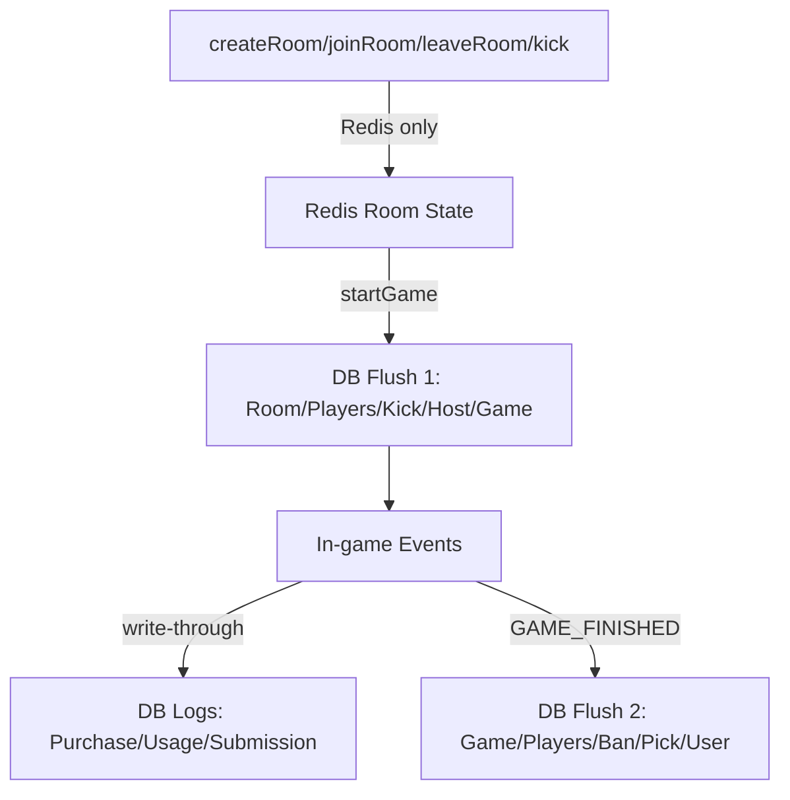

# REDIS_DB_TIMING

## 0. 문서 목적
- Redis와 DB의 저장 타이밍(Write Policy)을 명확히 정의한다.
- 로비~게임 종료 사이클에서 저장 시점을 일관되게 적용한다.

## 관련 문서
- [[03_DOMAIN/DATA_MODEL.md]]
- [[03_DOMAIN/DB_NOTES.md]]
- [[03_API/LIFECYCLE.md]]

---
## 1. 기본 원칙
- 실시간 상태(=ephemeral/derived)는 Redis가 단일 진실이다.
- DB는 결과/이력/정산에 필요한 persistent의 최종 저장소다.
- 로비 단계는 Redis-only로 운영한다.

---
## 2. Write Policy 정의
- write-through: 상태 변경 즉시 DB에 기록한다. Redis는 캐시/미러로만 사용한다.
- write-back: Redis가 실시간 단일 진실이다. 종료 시점에 DB로 스냅샷을 반영한다.

---
## 3. 단계별 저장 타이밍
| 단계 | 트리거 | Redis | DB | 대상 엔티티 |
|---|---|---|---|---|
| Phase 0: 로비 | 방 생성/참가/퇴장/강퇴 | 즉시 반영 | 기록 없음 | ROOM, ROOM_PLAYER, ROOM_KICK, ROOM_HOST_HISTORY |
| Phase 1: 게임 시작 | startGame | 스냅샷 고정 | 1차 DB flush | ROOM, ROOM_PLAYER, ROOM_KICK, ROOM_HOST_HISTORY, GAME, GAME_PLAYER |
| Phase 2: 게임 진행 | 인게임 이벤트 | 즉시 반영 | 필요 시 write-through | ITEM_USAGE, SPELL_USAGE, SUBMISSION, GAME_ITEM_PURCHASE, GAME_SPELL_PURCHASE |
| Phase 3: 게임 종료 | GAME_FINISHED | 최종 스냅샷 | 2차 DB flush | GAME, GAME_PLAYER, GAME_BAN, GAME_PICK, USER(coin/exp/score) |

---
## 4. 로비 해산 규칙
- 게임 시작 전에 방이 해산되면 DB에는 기록하지 않는다.
- 로비 단계 데이터는 Redis에서만 존재한다.

---
## 5. 다이어그램

