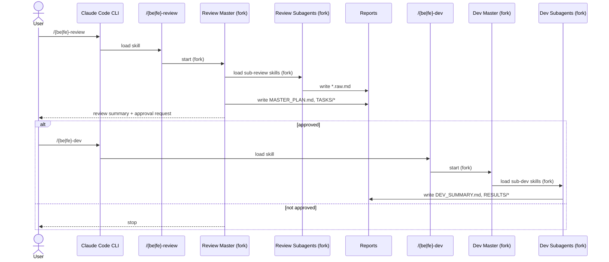
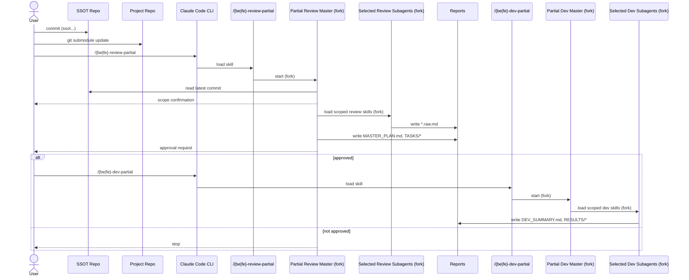

# 1. 목적
- Claude Code 서브에이전트 시스템을 실제 프로젝트에서 바로 사용할 수 있도록 제공합니다.
---
# 2. 범위
- 포함: 리뷰 마스터/서브에이전트 지침, 스킬 정의
- 제외: 실제 코드 변경
---
# 3. 디렉토리 구조
```text
AGENTS/CLAUDE/
  README.md # 이 문서
  PROTOCOLS/
    REVIEW_FINDING_SCHEMA.md # 리뷰 finding 스키마
    REVIEW_TASK_SCHEMA.md # 리뷰 task 스키마
    REVIEW_DEDUP_POLICY.md # 중복 제거 정책
    REVIEW_SUMMARY_FORMAT.md # 마스터 요약 형식
  AGENTS/
    COMMON/
      COMMIT_AGENT.md # 커밋 에이전트 지침
    BACKEND/
      README.md # BE 에이전트 분할 기준
      REVIEW/
        README.md # REVIEW 디렉토리 운영 원칙
        MASTER/ # 리뷰 마스터 에이전트
        SSOT/ # 도메인별 SSOT 리뷰 에이전트
        QUALITY/ # 도메인별 코드 품질 리뷰 에이전트
        LEGACY/ # 기존 단일 리뷰 에이전트(호환/참조)
      DEV/ # 개발/부분개발/adhoc/qna + 도메인 dev 에이전트
    FRONTEND/
      README.md # FE 에이전트 분할 기준
      REVIEW/
        README.md # REVIEW 디렉토리 운영 원칙
        MASTER/ # 리뷰 마스터 에이전트
        SSOT/ # 도메인별 SSOT 리뷰 에이전트
        QUALITY/ # 도메인별 코드 품질 리뷰 에이전트
        LEGACY/ # 기존 단일 리뷰 에이전트(호환/참조)
      DEV/ # 개발/부분개발/adhoc/qna + 도메인 dev 에이전트
  SKILLS/
    COMMON/
      commit-plan/ # 커밋 계획/실행 스킬
    BACKEND/REVIEW/
      be-review/ # BE 리뷰 파이프라인 진입점
      be-review-partial/ # BE 부분 리뷰 파이프라인 진입점
      be-review-*-ssot/ # BE 도메인별 SSOT 리뷰 스킬
      be-review-*-quality/ # BE 도메인별 QUALITY 리뷰 스킬
      be-review-*/ # 기존 단일 리뷰 스킬(호환/참조)
    BACKEND/DEV/
      be-dev/ # BE Dev 파이프라인 진입점
      be-dev-partial/ # BE Dev 부분 파이프라인 진입점
      be-adhoc/ # BE 즉시 수정 파이프라인 진입점
      be-qna/ # BE 코드 질의 파이프라인 진입점
      be-dev-auth-user/ # 인증/유저 Dev 스킬
      be-dev-room-lobby/ # 방/로비 Dev 스킬
      be-dev-game-lifecycle/ # 게임 라이프사이클 Dev 스킬
      be-dev-ban-pick-shop/ # 밴/픽/상점 Dev 스킬
      be-dev-realtime/ # 실시간 Dev 스킬
      be-dev-redis/ # Redis Dev 스킬
      be-dev-jpa-db/ # JPA/DB Dev 스킬
      be-dev-core-infra/ # 코어 인프라 Dev 스킬
    FRONTEND/REVIEW/
      fe-review/ # FE 리뷰 파이프라인 진입점
      fe-review-partial/ # FE 부분 리뷰 파이프라인 진입점
      fe-review-*-ssot/ # FE 도메인별 SSOT 리뷰 스킬
      fe-review-*-quality/ # FE 도메인별 QUALITY 리뷰 스킬
      fe-review-*/ # 기존 단일 리뷰 스킬(호환/참조)
    FRONTEND/DEV/
      fe-dev/ # FE Dev 파이프라인 진입점
      fe-dev-partial/ # FE Dev 부분 파이프라인 진입점
      fe-adhoc/ # FE 즉시 수정 파이프라인 진입점
      fe-qna/ # FE 코드 질의 파이프라인 진입점
      fe-dev-api/ # API Dev 스킬
      fe-dev-state/ # 상태 Dev 스킬
      fe-dev-routing/ # 라우팅 Dev 스킬
      fe-dev-realtime/ # 실시간 Dev 스킬
      fe-dev-quality/ # 품질/성능 Dev 스킬
```

---
# 4. Claude Code subagents 사용 가이드

## 4.1. 사전 요구사항
1. SSOT는 프로젝트에 `docs/` 경로로 연결되어 있어야 합니다.
2. 이 문서의 명령은 `.claude/`를 SSOT 기준으로 동기화합니다.
3. BACKEND 또는 FRONTEND 중 하나만 선택하여 적용해야 합니다.

## 4.2. 세팅
### 4.2.1. CLI 동기화 (권장)
```shell
# BACKEND
rm -rf .claude/agents .claude/skills
mkdir -p .claude/agents .claude/skills
rsync -a --delete docs/AGENTS/CLAUDE/AGENTS/BACKEND/ .claude/agents/BACKEND/
rsync -a --delete docs/AGENTS/CLAUDE/AGENTS/COMMON/ .claude/agents/COMMON/
rsync -a docs/AGENTS/CLAUDE/SKILLS/BACKEND/REVIEW/ .claude/skills/
rsync -a docs/AGENTS/CLAUDE/SKILLS/BACKEND/DEV/ .claude/skills/
rsync -a docs/AGENTS/CLAUDE/SKILLS/COMMON/ .claude/skills/
```

```shell
# FRONTEND
rm -rf .claude/agents .claude/skills
mkdir -p .claude/agents .claude/skills
rsync -a --delete docs/AGENTS/CLAUDE/AGENTS/FRONTEND/ .claude/agents/FRONTEND/
rsync -a --delete docs/AGENTS/CLAUDE/AGENTS/COMMON/ .claude/agents/COMMON/
rsync -a docs/AGENTS/CLAUDE/SKILLS/FRONTEND/REVIEW/ .claude/skills/
rsync -a docs/AGENTS/CLAUDE/SKILLS/FRONTEND/DEV/ .claude/skills/
rsync -a docs/AGENTS/CLAUDE/SKILLS/COMMON/ .claude/skills/
```

### 4.2.2. 수동 복사
1. `AGENTS/CLAUDE/AGENTS/`에서 프로젝트 유형에 맞는 디렉토리를 선택합니다.
2. 선택한 디렉토리를 `<프로젝트>/.claude/agents/`로 복사합니다.
3. `AGENTS/CLAUDE/AGENTS/COMMON/`을 `<프로젝트>/.claude/agents/COMMON/`로 복사합니다.
4. `AGENTS/CLAUDE/SKILLS/`에서 프로젝트 유형에 맞는 스킬 디렉토리를 선택합니다.
5. `AGENTS/CLAUDE/SKILLS/COMMON/`을 `<프로젝트>/.claude/skills/`로 복사합니다.
6. Claude Code를 재시작합니다.

### 4.2.3. permissions 등록
1. `.claude/settings.local.json`에 다음의 permissions 목록을 추가합니다.
```json
# BACKEND 프로젝트 (.claude/settings.local.json)
"Skill(be-review)",
"Skill(commit-plan)",
"Skill(be-review-partial)",
"Skill(be-review-auth-user-ssot)",
"Skill(be-review-auth-user-quality)",
"Skill(be-review-room-lobby-ssot)",
"Skill(be-review-room-lobby-quality)",
"Skill(be-review-game-lifecycle-ssot)",
"Skill(be-review-game-lifecycle-quality)",
"Skill(be-review-ban-pick-shop-ssot)",
"Skill(be-review-ban-pick-shop-quality)",
"Skill(be-review-realtime-ssot)",
"Skill(be-review-realtime-quality)",
"Skill(be-review-redis-ssot)",
"Skill(be-review-redis-quality)",
"Skill(be-review-jpa-db-ssot)",
"Skill(be-review-jpa-db-quality)",
"Skill(be-review-core-infra-ssot)",
"Skill(be-review-core-infra-quality)",
"Skill(be-dev)",  
"Skill(be-dev-partial)",
"Skill(be-adhoc)",
"Skill(be-qna)",
"Skill(be-dev-auth-user)",  
"Skill(be-dev-room-lobby)",  
"Skill(be-dev-game-lifecycle)",  
"Skill(be-dev-ban-pick-shop)",  
"Skill(be-dev-realtime)",  
"Skill(be-dev-redis)",  
"Skill(be-dev-jpa-db)",  
"Skill(be-dev-core-infra)"

# FRONTEND 프로젝트 (.claude/settings.local.json)
"Skill(fe-review)",
"Skill(commit-plan)",
"Skill(fe-review-partial)",
"Skill(fe-review-api-ssot)",
"Skill(fe-review-api-quality)",
"Skill(fe-review-state-ssot)",
"Skill(fe-review-state-quality)",
"Skill(fe-review-routing-ssot)",
"Skill(fe-review-routing-quality)",
"Skill(fe-review-realtime-ssot)",
"Skill(fe-review-realtime-quality)",
"Skill(fe-review-quality-ssot)",
"Skill(fe-review-quality-quality)",
"Skill(fe-dev)",
"Skill(fe-dev-partial)",
"Skill(fe-adhoc)",
"Skill(fe-qna)",
"Skill(fe-dev-api)",
"Skill(fe-dev-state)",
"Skill(fe-dev-routing)",
"Skill(fe-dev-realtime)",
"Skill(fe-dev-quality)"
```
2. Claude Code를 재시작합니다.

### 4.2.4. `.claude/` 디렉토리 세팅 구조 예시
```text
# 예시 구조
.claude
├── agents
│   ├── COMMON
│   │   └── COMMIT_AGENT.md
│   └── BACKEND
│       ├── DEV
│       │   ├── BE_DEV_AUTH_USER_AGENT.md
│       │   ├── ...
│       │   └── BE_DEV_BAN_PICK_SHOP_AGENT.md
│       └── REVIEW
│           ├── MASTER
│           │   ├── BE_REVIEW_MASTER_AGENT.md
│           │   └── BE_REVIEW_PARTIAL_MASTER_AGENT.md
│           ├── SSOT
│           │   ├── AUTH_USER_SSOT_REVIEW_AGENT.md
│           │   └── ...
│           ├── QUALITY
│           │   ├── AUTH_USER_QUALITY_REVIEW_AGENT.md
│           │   └── ...
│           └── LEGACY
│               └── AUTH_USER_REVIEW_AGENT.md
├── skills
│   ├── commit-plan
│   │   └── SKILL.md
│   ├── be-review
│   │   └── SKILL.md
│   ├── be-review-partial
│   │   └── SKILL.md
│   ├── be-dev
│   │   └── SKILL.md
│   ├── be-dev-partial
│   │   └── SKILL.md
│   ├── be-adhoc
│   │   └── SKILL.md
│   ├── be-qna
│   │   └── SKILL.md
│   ├── be-review-auth-user-ssot
│   │   └── SKILL.md
│   ├── be-review-auth-user-quality
│   │   └── SKILL.md
│   ├── ...
│   └── be-dev-auth-user
│       └── SKILL.md
└── settings.local.json
```

## 4.3. AGENT & SKILLS WORKFLOW
### 4.3.1. 제공 기능

| 구분    | 목적                       | 실행 스킬                                      | 결과물                          | 비고              |
| ----- | ------------------------ | ------------------------------------------ | ---------------------------- | --------------- |
| 전체 리뷰 | 프로젝트 전체 SSOT 정합성 및 품질 검수 | `/be-review`, `/fe-review`                 | `MASTER_PLAN.md`, `TASKS/`   | 승인 후 전체 개발 실행   |
| 부분 리뷰 | SSOT 변경 범위만 선택적 검수       | `/be-review-partial`, `/fe-review-partial` | `MASTER_PLAN.md`, `TASKS/`   | 커밋 컨벤션 기반 범위 결정 |
| 전체 개발 | 전체 리뷰 태스크 구현             | `/be-dev`, `/fe-dev`                       | `DEV_SUMMARY.md`, `RESULTS/` | 리뷰 승인 후 실행      |
| 부분 개발 | 부분 리뷰 태스크 구현             | `/be-dev-partial`, `/fe-dev-partial`       | `DEV_SUMMARY.md`, `RESULTS/` | 부분 리뷰 승인 후 실행   |
| 즉시 수정 | 단일 오류/이슈 즉시 수정           | `/be-adhoc`, `/fe-adhoc`                   | `DEV_SUMMARY.md`, `RESULTS/` | 테스트 중 즉시 대응     |
| 코드 질의 | 코드 기반 질의 응답              | `/be-qna`, `/fe-qna`                       | 대화 응답                        | 결과 파일 생성 없음     |

### 4.3.2. SSOT 전체  정합성 및 코드 품질 검수 에이전트
> 프로젝트 SSOT 명세와 현재까지 진행된 프로젝트 간 명세-구현 정합성 및 코드 품질 리뷰를 수행합니다.




**유스케이스**
1. Claude Code CLI에서 커스텀 스킬을 로드합니다.
   ```shell
   # BACKEND REVIEW COMMAND
   /be-review

   # FRONTEND REVIEW COMMAND
   /fe-review
   ```
2. 스킬에 정의된 지침에 따라 Review Master가 `fork()`하여 실행되며, 다음 작업을 수행합니다.
   - 정의된 review 스킬을 로드하여 모든 sub-review-agent를 `fork()` 하여 실행합니다.
   - 각 서브 에이전트의 리뷰 결과가 다음 경로에 생성됩니다.
     ```markdown
     /.claude/reports/review/{be|fe}/full/active/
     ├── *.raw.md                 # 각 서브 에이전트의 리뷰 결과 보고서
     ├── MASTER_PLAN.md           # 마스터 리뷰 에이전트의 종합 보고서
     └── TASKS/
         └── TASK-XXX.md          # 마스터 리뷰 에이전트의 작업 설계 보고서
     ```
3. 사용자는 마스터 리뷰 결과를 확인한 후, 다음 중 하나로 승인 여부를 선택합니다.
   - A) 프롬프트에서 승인 여부를 답변하여 작업을 시작합니다.
     - ![[assets/review-agent-result-capture.png]]
   - B) 마스터 Dev 에이전트를 호출하여 작업을 시작합니다.
     - **dev 스킬 로드**
       ```shell
       # BACKEND DEV COMMAND
       /be-dev

       # FRONTEND DEV COMMAND
       /fe-dev
       ```
     - **작업 시작 예시**
       ![[assets/further-task-proceed-capture.png]]
4. 스킬에 정의된 지침에 따라 Dev Master가 `fork()`하여 실행되며, 다음 작업을 수행합니다.
   - Review Master가 생성한 `MASTER_PLAN.md` 및 `TASKS/TASK-XXX.md`를 참조합니다.
   - 작업 계획에 지정된 dev 스킬을 로드하여 모든 sub-dev-agent를 `fork()` 실행합니다.
   - 각 서브 에이전트의 작업 결과가 다음 경로에 생성됩니다.
     ```markdown
     /.claude/reports/dev/{be|fe}/full/active/
     ├── DEV_SUMMARY.md           # 전체 태스크 수행 결과 요약
     └── RESULTS/
         └── TASK-XXX.md          # 태스크 단위 작업 결과 보고서
     ```
5. 필요 시 `/commit-plan` 스킬을 수동으로 실행하여 커밋 계획을 진행합니다.

### 4.3.3. 프로젝트 부분 SSOT 정합성 검수 및 작업 에이전트
> SSOT 변경 범위만 선택적으로 검수하고, 승인 후 부분 개발을 진행합니다.




**유스케이스**
1. SSOT 명세를 수정 후 커밋 컨벤션에 따라 커밋합니다.
   ```text
   # 단일 도메인 수정 발생의 경우
   ssot(<domain>): <action> <summary>
   
   # 복합 도메인 수정 발생의 경우
   ssot: <action> <summary>
   ```
2. 대상 프로젝트에서 SSOT 서브모듈을 최신 상태로 업데이트합니다.
   ```shell
   git submodule update --remote --merge
   ```
3. Claude Code CLI에서 리뷰 스킬을 로드합니다.
   ```shell
   # BACKEND PARTIAL REVIEW COMMAND
   /be-review-partial

   # FRONTEND PARTIAL REVIEW COMMAND
   /fe-review-partial
   ```
4. 스킬에 정의된 지침에 따라 Partial Review Master가 `fork()`하여 실행되며, 다음 작업을 수행합니다.
   - SSOT 서브모듈의 최신 커밋을 분석하여 작업 도메인을 확정합니다.
   - 확정 도메인에 대한 작업 설계 후 사용자 승인을 요청합니다.
   - 승인 시 리뷰 스킬을 로드하여 sub-review-agent를 `fork()` 실행합니다.
   - 리뷰 결과가 다음 경로에 생성됩니다.
     ```markdown
     /.claude/reports/review/{be|fe}/partial/active/
     ├── *.raw.md                 # 선택된 도메인의 리뷰 결과 보고서
     ├── MASTER_PLAN.md           # 마스터 리뷰 에이전트의 종합 보고서
     └── TASKS/
         └── TASK-XXX.md          # 마스터 리뷰 에이전트의 작업 설계 보고서
     ```
5. 사용자는 마스터 리뷰 결과를 확인한 후, 승인 여부를 선택합니다.
6. 승인 시 부분 개발 스킬을 실행합니다.
   ```shell
   # BACKEND PARTIAL DEV COMMAND
   /be-dev-partial

   # FRONTEND PARTIAL DEV COMMAND
   /fe-dev-partial
   ```
7. 스킬에 정의된 지침에 따라 Partial Dev Master가 `fork()`하여 실행되며, 다음 작업을 수행합니다.
   - Review Master가 생성한 `MASTER_PLAN.md` 및 `TASKS/TASK-XXX.md`를 참조합니다.
   - 태스크에 지정된 dev 스킬을 로드하여 sub-dev-agent를 `fork()` 실행합니다.
   - 작업 결과가 다음 경로에 생성됩니다.
     ```text
     /.claude/reports/dev/{be|fe}/partial/active/
     ├── DEV_SUMMARY.md           # 전체 태스크 수행 결과 요약
     └── RESULTS/
         └── TASK-XXX.md          # 태스크 단위 작업 결과 보고서
     ```
8. 필요 시 `/commit-plan` 스킬을 수동으로 실행하여 커밋 계획을 진행합니다.

### 4.3.4. 부분 오류 수정 에이전트
> 테스트 중 발견된 단일 오류 등 부분 수정 작업을 지원합니다.

**유스케이스**
1. Claude Code CLI에서 오류 수정 스킬을 로드합니다.
   ```shell
   # BACKEND ADHOC COMMAND
   /be-adhoc

   # FRONTEND ADHOC COMMAND
   /fe-adhoc
   ```
2. 에러 로그, 재현 방법, 기대 결과를 전달합니다.
3. Ad-hoc Dev Master가 단일 태스크를 구성하고 서브에이전트를 호출합니다.
4. 결과는 다음 경로에 생성됩니다.
   ```text
   /.claude/reports/dev/{be|fe}/adhoc/active/
   ├── DEV_SUMMARY.md           # 전체 태스크 수행 결과 요약
   └── RESULTS/
       └── TASK-XXX.md          # 태스크 단위 작업 결과 보고서
   ```

### 4.3.5. 코드 질의 및 구조 확인 에이전트
> 코드 구조/동작에 대한 질문에 응답합니다.

**유스케이스**
1. Claude Code CLI에서 QnA 스킬을 로드합니다.
   ```shell
   # BACKEND QNA COMMAND
   /be-qna

   # FRONTEND QNA COMMAND
   /fe-qna
   ```
2. 질문을 전달합니다.
3. QnA 에이전트가 코드 기반 답변을 제공합니다.
4. QnA는 별도 결과 파일을 생성하지 않습니다.

---
# 5. V2 리뷰 구조 (SSOT/QUALITY 분리)

## 5.1. 개요
- Full/Partial Review 모두에서 도메인별 SSOT 리뷰와 QUALITY 리뷰를 각각 수행합니다.
- QUALITY 리뷰는 SSOT raw 결과를 입력으로 사용하지 않고 독립 수행합니다.
- 중복 제거 및 우선순위 정리는 Review Master가 수행합니다.

## 5.2. 신규 네이밍 규칙
- Backend: `/be-review-<domain>-ssot`, `/be-review-<domain>-quality`
- Frontend: `/fe-review-<domain>-ssot`, `/fe-review-<domain>-quality`

## 5.3. Full Review 실행 규칙
1. `/be-review` 또는 `/fe-review` 호출
2. 각 도메인의 SSOT/QUALITY 스킬을 모두 실행
3. `*_ssot_raw.md`, `*_quality_raw.md` 생성 확인
4. Master가 중복 제거 후 `MASTER_PLAN.md`, `TASKS/TASK-XXX.md` 생성

## 5.4. Partial Review 실행 규칙
1. `/be-review-partial` 또는 `/fe-review-partial` 호출
2. SSOT 커밋 컨벤션으로 도메인 확정
3. 확정된 각 도메인에 대해 SSOT/QUALITY 스킬 모두 실행
4. Partial Master가 결과 통합 및 승인 요청

## 5.5. 리포트 파일 규칙
- Backend full: `.claude/reports/review/be/full/active/<domain>_ssot_raw.md`, `.claude/reports/review/be/full/active/<domain>_quality_raw.md`
- Frontend full: `.claude/reports/review/fe/full/active/<domain>_ssot_raw.md`, `.claude/reports/review/fe/full/active/<domain>_quality_raw.md`
- Partial도 동일하게 `.../{be|fe}/partial/active/` 경로를 사용합니다.

## 5.6. 공통 프로토콜
- 리뷰 결과 스키마/태스크 스키마/중복 제거 정책은 다음 문서를 따릅니다.
  - `AGENTS/CLAUDE/PROTOCOLS/REVIEW_FINDING_SCHEMA.md`
  - `AGENTS/CLAUDE/PROTOCOLS/REVIEW_TASK_SCHEMA.md`
  - `AGENTS/CLAUDE/PROTOCOLS/REVIEW_DEDUP_POLICY.md`
  - `AGENTS/CLAUDE/PROTOCOLS/REVIEW_SUMMARY_FORMAT.md`

## 5.7. permissions 추가 주의
- 기존 `be-review-<domain>`/`fe-review-<domain>` 단일 스킬 대신, `-ssot`, `-quality` 스킬을 모두 permissions에 등록해야 합니다.
- 예시:
  - `Skill(be-review-auth-user-ssot)`
  - `Skill(be-review-auth-user-quality)`
  - `Skill(fe-review-api-ssot)`
  - `Skill(fe-review-api-quality)`
