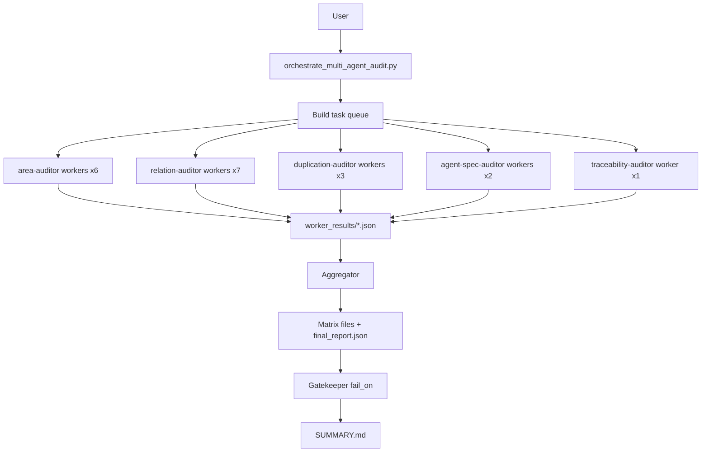

# Multi-Agent System Design

## Agent Inventory

| agent_id | target kind | fan-out |
|---|---|---:|
| area-auditor | area | 6 |
| relation-auditor | relation | 7 |
| duplication-auditor | duplication | 3 |
| agent-spec-auditor | agent_spec | 2 |
| traceability-auditor | traceability | 1 |
| aggregator (orchestrator internal) | all | 1 |
| gatekeeper (orchestrator internal) | all | 1 |

## Execution Sequence

## Contracts

- worker request schema: `schemas/worker_request.schema.json`
- worker result schema: `schemas/worker_result.schema.json`
- final report schema: `schemas/final_report.schema.json`

## Notes

- Worker context isolation is process-level isolation via parallel `codex exec` calls.
- The orchestrator writes prompts and request payloads for reproducibility.
- Partial mode reduces fan-out based on changed file path hints.
