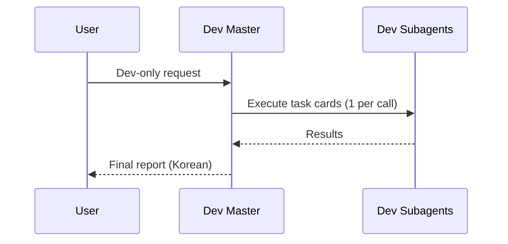
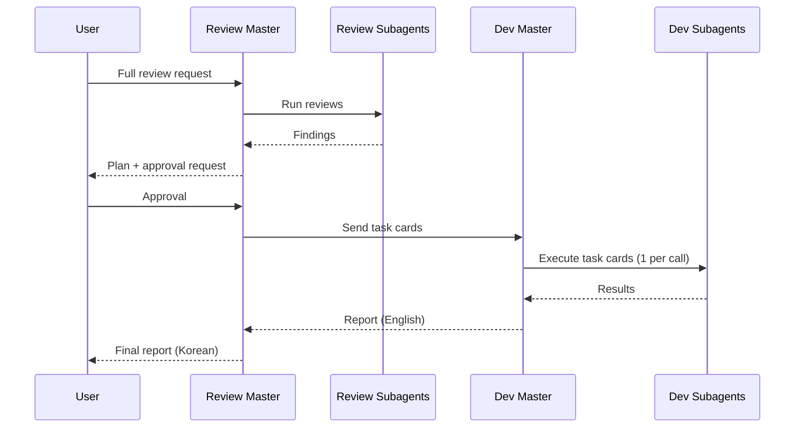

**Claude Code 서브에이전트 시스템**
- Dev/Review는 엄격히 분리한다.
- Master는 오케스트레이션만 수행하고 코드 수정은 하지 않는다.
- Subagent는 자신의 도메인 경계 내에서만 작업한다.
- 스펙을 읽지 않고 결정을 내리지 않는다.

**디렉토리 트리 (AGENTS/)**
```text
AGENTS/
  README.md                               # 이 문서
  FRONTEND/                               # 프론트엔드 에이전트 집합(UI 제외)
    DEV/                                  # 프론트엔드 개발 에이전트
      MASTER_AGENT.md                     # FE Dev Master (오케스트레이션)
      API_AGENT.md                        # API 연동
      STATE_AGENT.md                      # 상태 관리
      ROUTING_AGENT.md                    # 라우팅/네비게이션
      REALTIME_AGENT.md                   # 실시간/소켓
      PERF_RELIABILITY_AGENT.md           # 성능/안정성
    REVIEW/                               # 프론트엔드 리뷰 에이전트
      MASTER_AGENT.md                     # FE Review Master (오케스트레이션)
      API_REVIEW_AGENT.md                 # API 연동 리뷰
      STATE_REVIEW_AGENT.md               # 상태 관리 리뷰
      ROUTING_REVIEW_AGENT.md             # 라우팅/네비게이션 리뷰
      REALTIME_REVIEW_AGENT.md            # 실시간/소켓 리뷰
      QUALITY_REVIEW_AGENT.md             # 품질/회귀/베스트프랙티스 리뷰
  BACKEND/                                # 백엔드 에이전트 집합
    DEV/                                  # 백엔드 개발 에이전트
      MASTER_AGENT.md                     # BE Dev Master (오케스트레이션)
      AUTH_USER_AGENT.md                  # 인증/유저 도메인
      ROOM_LOBBY_AGENT.md                 # 방/로비 도메인
      GAME_LIFECYCLE_AGENT.md             # 게임 라이프사이클
      BAN_PICK_SHOP_AGENT.md              # 밴/픽/상점 도메인
      REALTIME_CHAT_AGENT.md              # 실시간/채팅
      CORE_INFRA_AGENT.md                 # 코어 인프라/공통
      REDIS_AGENT.md                      # Redis/캐시/퍼브섭
    REVIEW/                               # 백엔드 리뷰 에이전트
      MASTER_AGENT.md                     # BE Review Master (오케스트레이션)
      AUTH_USER_REVIEW_AGENT.md           # 인증/유저 도메인 리뷰
      ROOM_LOBBY_REVIEW_AGENT.md          # 방/로비 도메인 리뷰
      GAME_LIFECYCLE_REVIEW_AGENT.md      # 게임 라이프사이클 리뷰
      BAN_PICK_SHOP_REVIEW_AGENT.md       # 밴/픽/상점 도메인 리뷰
      REALTIME_CHAT_REVIEW_AGENT.md       # 실시간/채팅 리뷰
      CORE_INFRA_REVIEW_AGENT.md          # 코어 인프라 리뷰
      REDIS_REVIEW_AGENT.md               # Redis/캐시/퍼브섭 리뷰
      JPA_DB_REVIEW_AGENT.md              # JPA/DB 성능 및 안티패턴 리뷰
```

**구조**
- `AGENTS/FRONTEND/DEV`
- `AGENTS/FRONTEND/REVIEW`
- `AGENTS/BACKEND/DEV`
- `AGENTS/BACKEND/REVIEW`
- 모든 에이전트 파일명은 `*_AGENT.md` 형식을 사용한다.

**언어 정책**
- 에이전트 간 통신은 **영어**로 한다.
- 사용자에게 직접 응답할 때만 **한국어**를 사용한다.
- Subagent는 원칙적으로 사용자에게 직접 응답하지 않는다.

**모델**
- 모든 Master 에이전트는 `opus`를 사용한다.
- 모든 비마스터 에이전트는 `sonnet`을 사용한다.

**실행 흐름 (요약)**
- Review Master가 Review Subagent를 호출해 리뷰를 수행하고 결과를 통합한다.
- Review Master가 작업 카드와 계획을 제시하고 사용자 승인을 받는다.
- 승인 후 Review Master가 Dev Master를 호출해 작업 카드를 전달한다.
- Dev Master는 **작업 카드 1건당 Subagent 1회 호출**을 수행한다.
- Dev Master는 결과를 영어로 Review Master에 보고한다.
- Review Master가 최종 결과를 한국어로 사용자에게 보고한다.
- 1회 승인에 대해 **1회 수정 사이클만** 수행한다(추가 이슈는 재승인 필요).

**시퀀스 다이어그램: Dev-only**


**시퀀스 다이어그램: Review + Remediation**


**사용 플로우: Dev-only**
1. 사용자가 Dev Master를 호출한다.
2. Dev Master가 SSOT 기준으로 작업을 분해한다.
3. Dev Master가 작업 카드 단위로 Dev Subagent를 호출한다.
4. Dev Master가 최종 결과를 사용자에게 보고한다.

**사용 플로우: Review + Remediation**
1. 사용자가 Review Master를 호출해 전수 리뷰를 수행한다.
2. Review Master가 Review Subagent를 호출해 리뷰를 수행한다.
3. Review Master가 작업 카드와 계획을 제시하고 사용자 승인을 받는다.
4. 승인 후 Review Master가 Dev Master를 호출해 작업 카드를 전달한다.
5. Dev Master가 작업 카드당 1회로 Dev Subagent를 호출해 수정한다.
6. Dev Master가 결과를 Review Master에 영어로 보고한다.
7. Review Master가 최종 결과를 한국어로 사용자에게 보고한다.

**Frontend 범위**
- 포함: API 연동, 상태, 라우팅, 실시간, 성능/안정성
- 제외: UI/시각 디자인, 스타일링, 레이아웃, 컴포넌트 미관

**Backend 범위**
- 포함: API, 도메인 로직, 영속성, 실시간, 정합성, 성능, 보안
